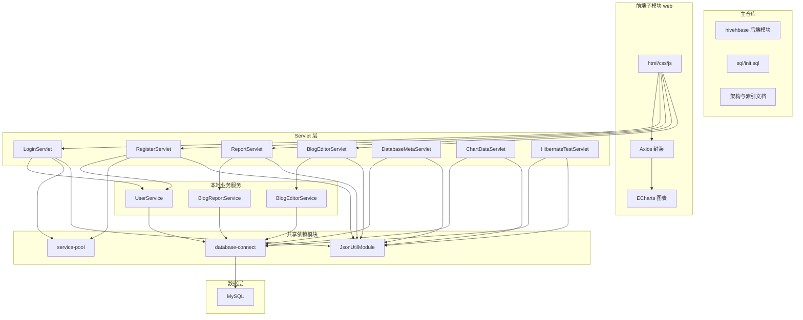

# 系统架构

## 1. 整体架构



## 2. 核心模块

### 2.1 后端主工程

- 路径：`hivehbase/`
- 负责 Servlet、Filter、本地业务服务、测试与 WAR 打包
- 通过 `maven-war-plugin` 将 `web/` 子模块资源打入 WAR

### 2.2 前端子模块

- 路径：`web/`
- 负责页面、样式、浏览器端交互逻辑
- 作为独立 Git 子模块维护

### 2.3 共享依赖模块

- `database-connect`：提供 `HibernateUtil`、`DatabaseMetaService`、对象池工具等
- `JsonUtilModule`：提供 `JsonUtil`
- `service-pool`：提供通用对象池实现

### 2.4 数据模型

- 本地业务表固定为 `user` 与 `blog`
- 初始化脚本位于 `sql/init.sql`

## 3. 数据流向

```text
浏览器页面
  -> Axios / Request 封装
  -> Servlet
  -> 本地 Service 或共享依赖模块
  -> Hibernate / MySQL
  -> JSON 响应
  -> 前端渲染
```

## 4. 技术选型

| 技术 | 版本 | 用途 |
|------|------|------|
| Java | 17 | 后端主语言 |
| Servlet | 4.0 | Web 控制器 |
| Hibernate | 6.x | ORM / 原生 SQL 执行 |
| MySQL | 8.x | 业务数据库 |
| Maven | 3.9+ | 构建与打包 |
| Git Submodule | - | 管理 AGENTS 与 web 子模块 |
| Axios | 1.x | 前端 HTTP 请求 |
| ECharts | 5/6 | 图表渲染 |
